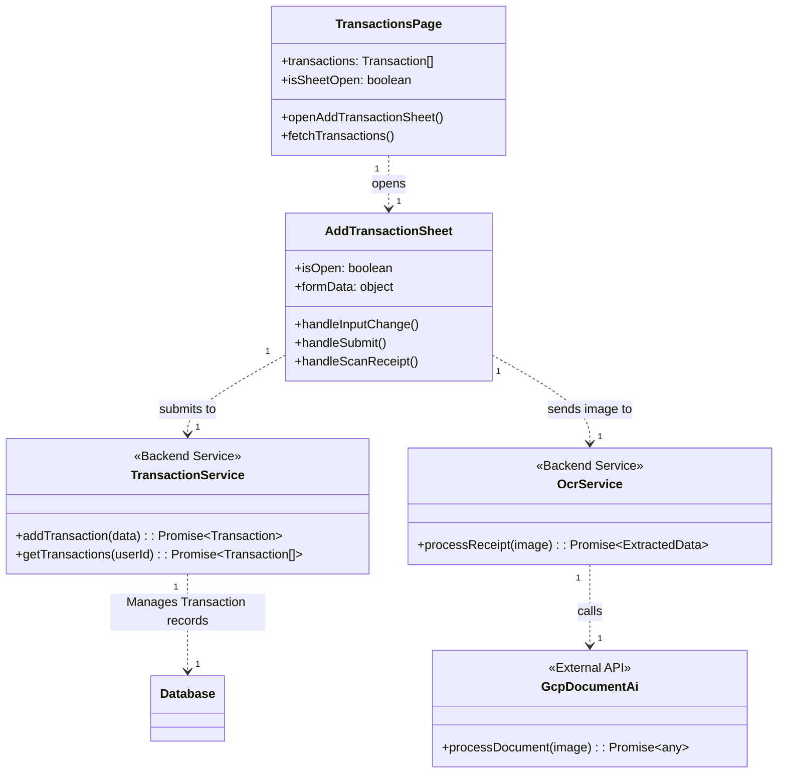
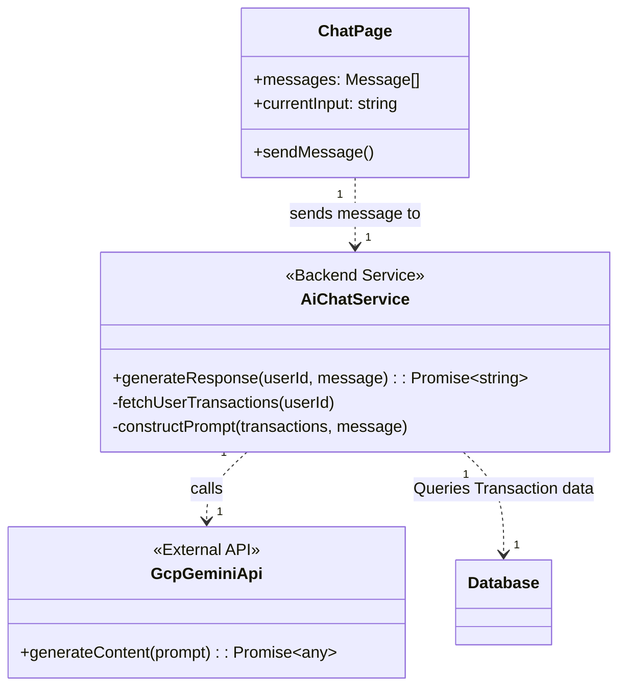
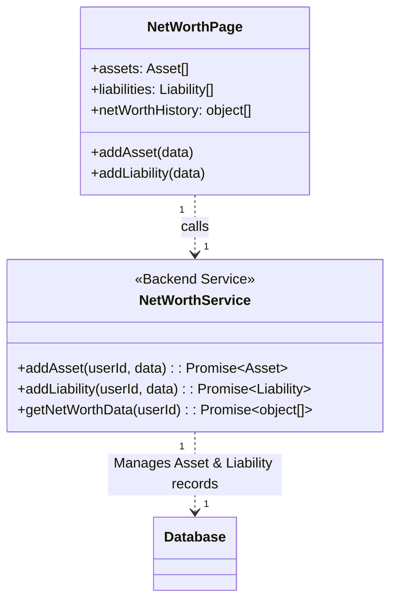
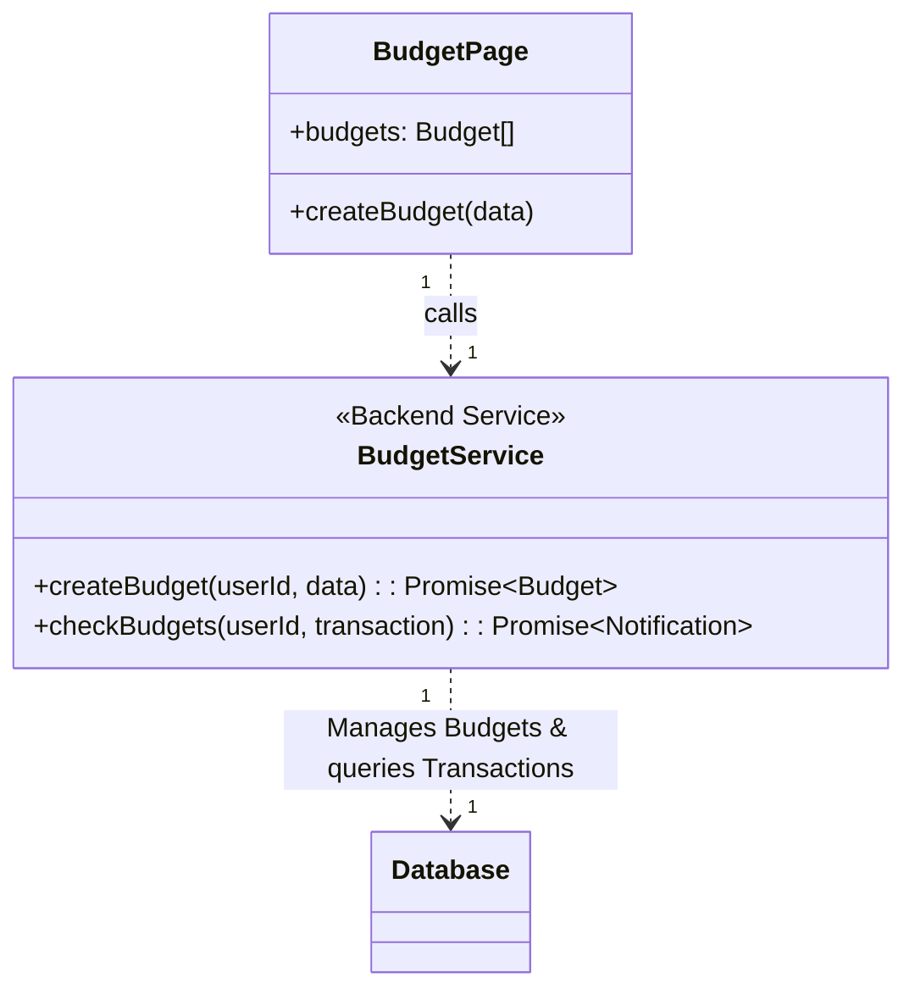
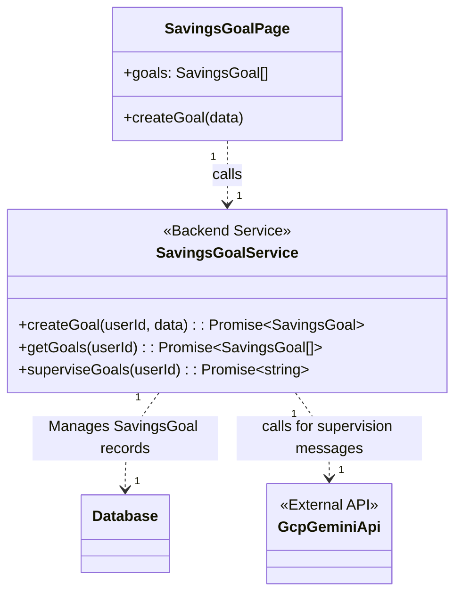
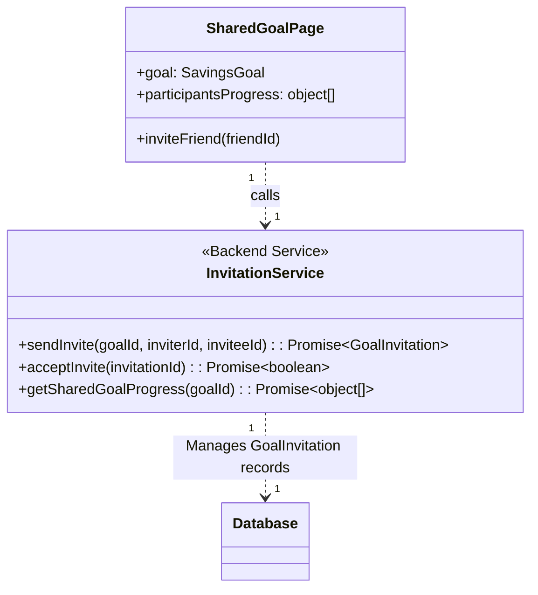
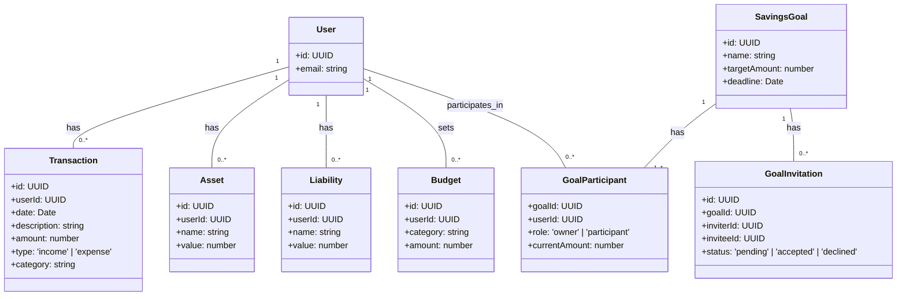

# Class Diagrams for FinWise Buddy

This document provides class diagrams that describe the program architecture for FinWise Buddy, including its components, services, data models, and their relationships. The diagrams are based on the PRD and Sequence Diagrams.

---

### 1. High-Level System Architecture

This diagram shows the main architectural components and their interactions at a high level.

```mermaid
classDiagram
    direction LR
    package "Frontend (React + Vite)" {
        class FrontendApp {
            +UI Components
            +State Management
            +API Client
        }
    }
    package "Backend (Supabase)" {
        class EdgeFunctions {
            +TransactionService
            +AiChatService
            +OcrService
            +...
        }
        class Database {
            +PostgreSQL Tables
            +User Data
            +Transaction Data
        }
    }
    package "External Services (GCP)" {
        class GcpAiServices {
            +Document AI
            +Gemini API
            +Vision AI
        }
    }

    FrontendApp --|> EdgeFunctions : (HTTPS/API Calls)
    EdgeFunctions --|> Database : (CRUD Operations)
    EdgeFunctions --|> GcpAiServices : (API Calls)
```

---

### 2. Transaction Management (MVP)

This diagram details the classes involved in tracking expenses and income, including manual and OCR-based entry.



---

### 3. AI Chat Interaction (MVP)

This diagram shows the classes for the AI financial assistant feature.



---

### 4. Asset & Liability Consolidation (Post-MVP)

This diagram outlines the classes for managing a user's net worth.



---

### 5. Income & Expense Budgeting (Post-MVP)

This diagram shows the classes related to setting and monitoring budgets.



---

### 6. Savings Goals & AI Supervision (Post-MVP)

This diagram shows the classes for creating and supervising savings goals.



---

### 7. Socialized Saving (Post-MVP)

This diagram outlines the classes for the shared savings goal feature.



---

### 8. Data Models

This diagram shows the core data entities and their relationships within the database.



