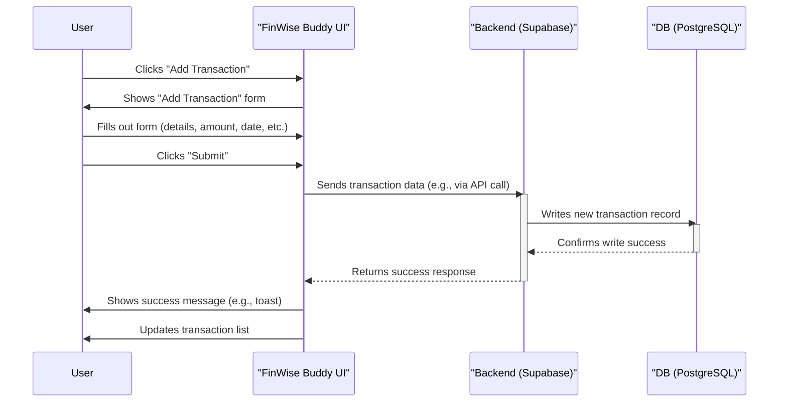
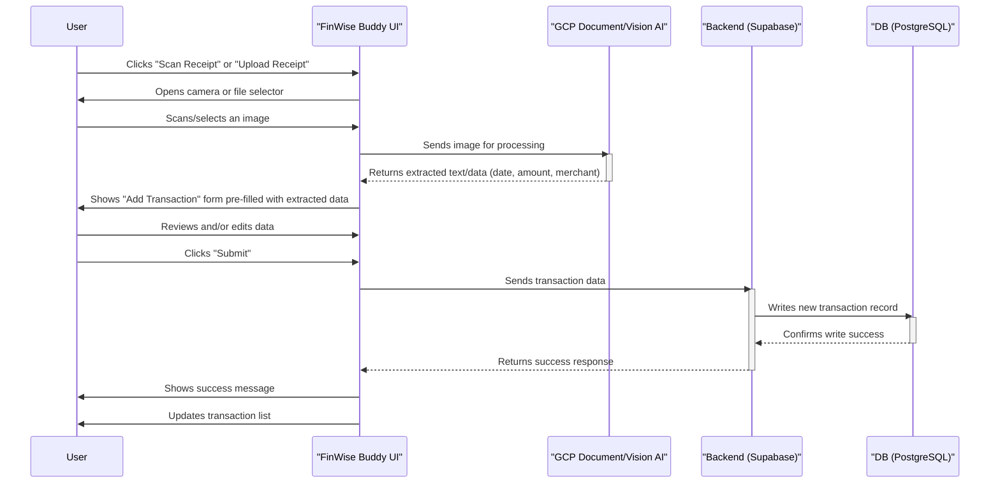
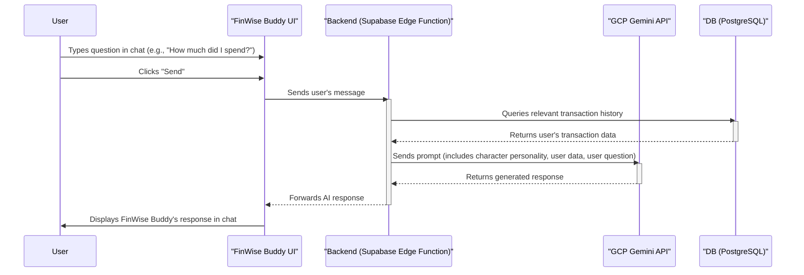
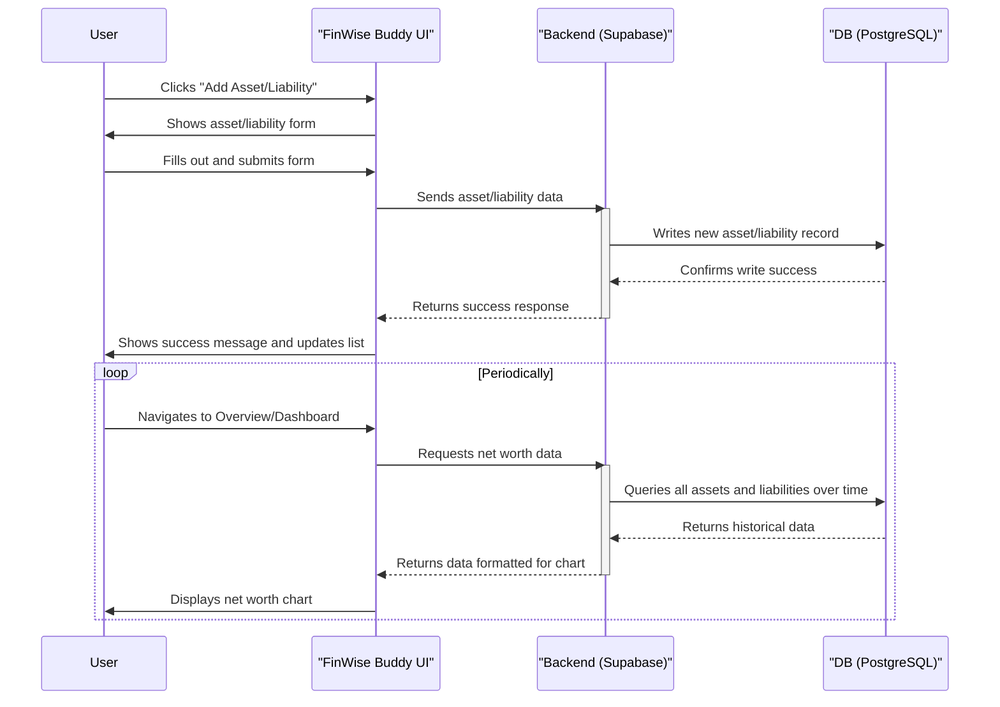
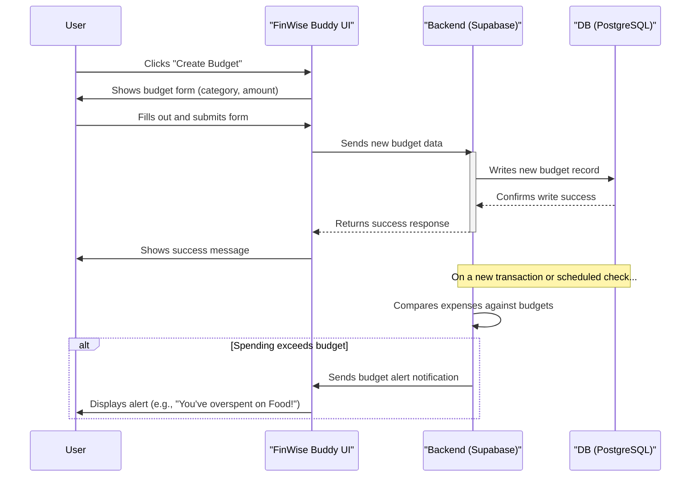
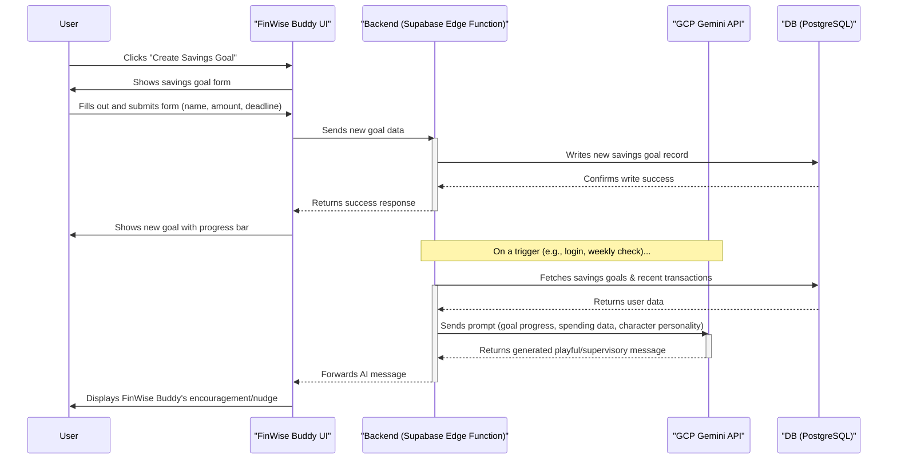
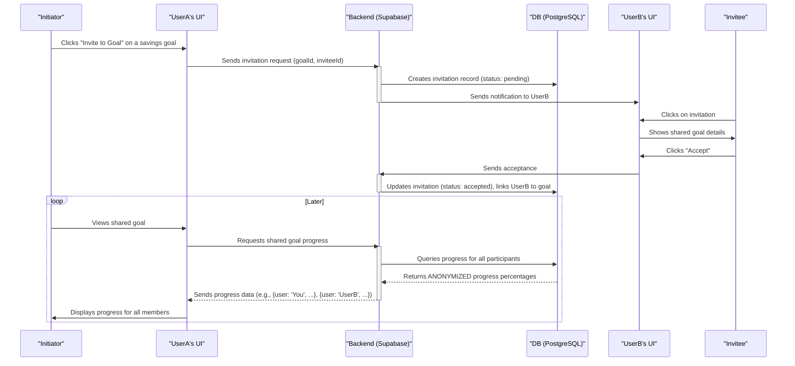

# Sequence Diagrams for FinWise Buddy

This document outlines the sequence of operations for the core features of the FinWise Buddy application as defined in the PRD. We use Mermaid syntax to represent the diagrams.

---

### 1. Manual Transaction Entry

This diagram shows the process of a user manually adding a new expense or income transaction.

---

### 2. OCR-Based Transaction Entry (Scan/Upload)

This diagram illustrates the flow when a user scans or uploads a receipt to create a transaction.

---

### 3. AI Chat Interaction

This diagram shows how the user interacts with the FinWise Buddy AI to ask financial questions.

---

### 4. Asset & Liability Consolidation

This diagram shows how a user adds an asset or liability and views their net worth.

---

### 5. Income & Expense Budgeting

This diagram shows how a user sets a budget and gets alerted.

---

### 6. Savings Goals & AI Supervision

This diagram shows how a user creates a savings goal and how FinWise Buddy supervises it.

---

### 7. Socialized Saving (Invite Friends)

This diagram illustrates the process of inviting a friend to a shared savings goal.

