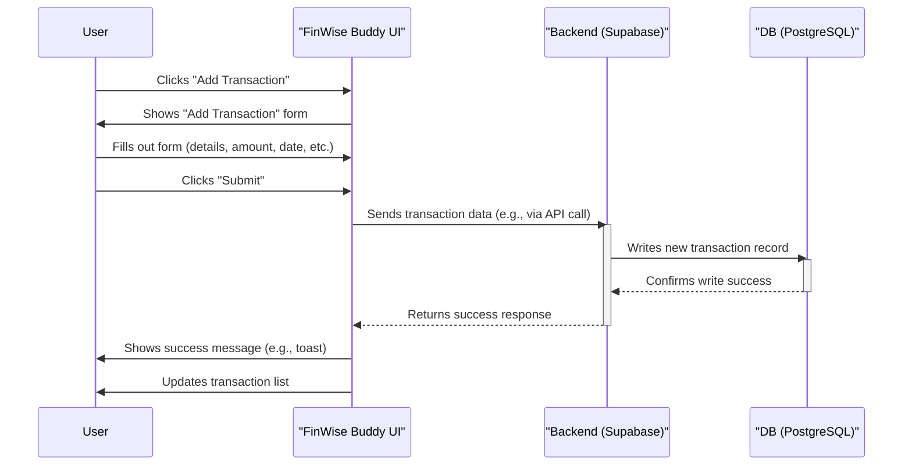
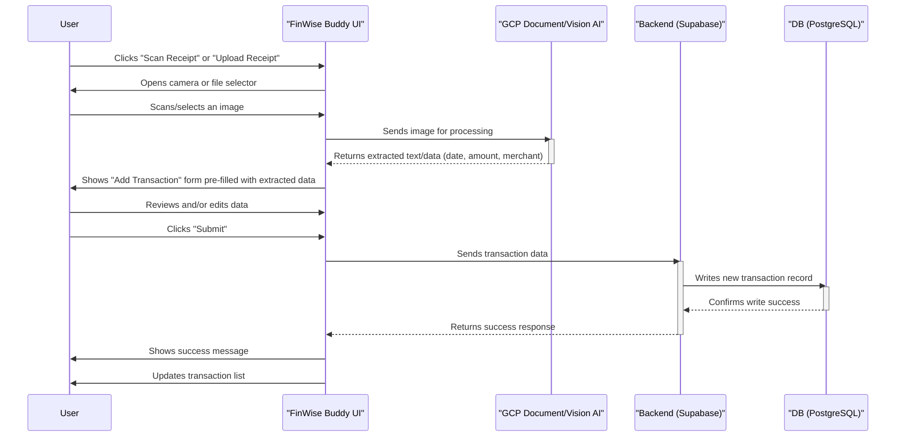
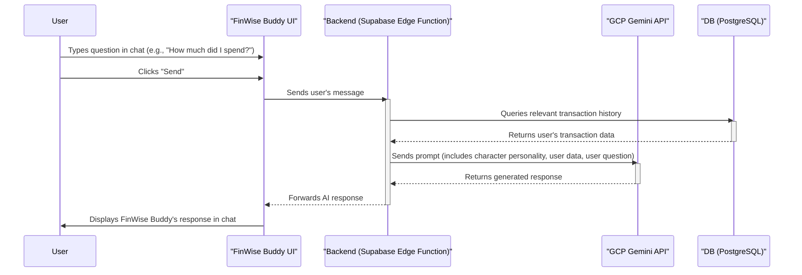

# Sequence Diagrams for FinWise Buddy

This document outlines the sequence of operations for the core features of the FinWise Buddy application as defined in the PRD. We use Mermaid syntax to represent the diagrams.

---

### 1. Manual Transaction Entry

This diagram shows the process of a user manually adding a new expense or income transaction.

---

### 2. OCR-Based Transaction Entry (Scan/Upload)

This diagram illustrates the flow when a user scans or uploads a receipt to create a transaction.

---

### 3. AI Chat Interaction

This diagram shows how the user interacts with the FinWise Buddy AI to ask financial questions.

